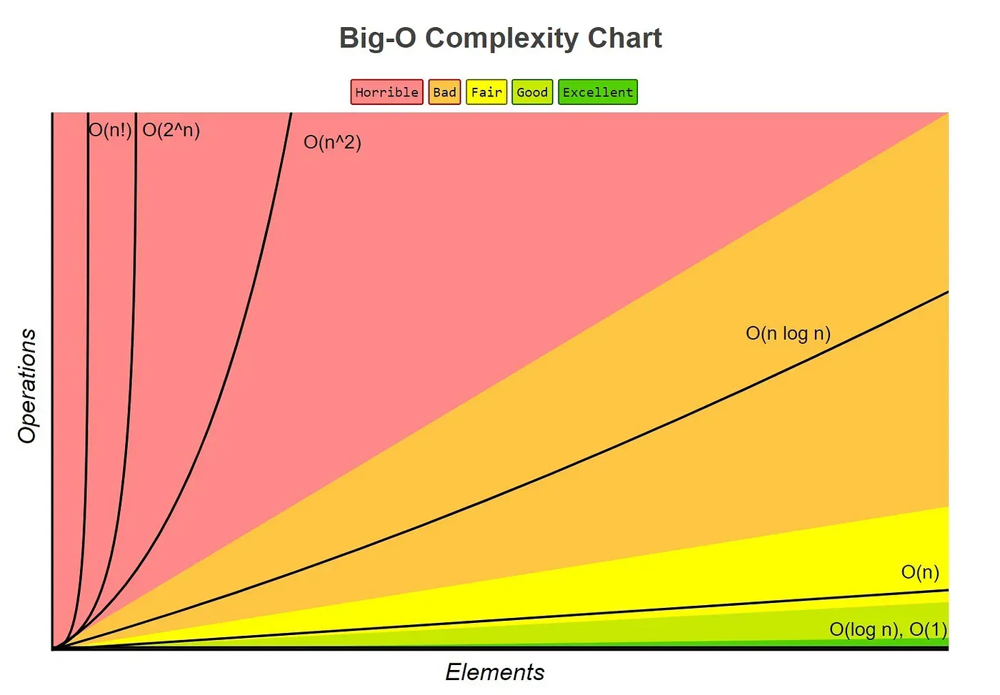

# Day 5 — Big-O Notation (Python / DSA)

Timebox: ~3 hours  
Objective: Understand and apply time & space complexity to reason about algorithm efficiency.

### Learning outcomes
- Define Big-O (worst‑case growth rate)
- Classify code (O(1), O(log n), O(n), O(n^2))
- Derive complexity from loops, nesting, digit processing
- Distinguish time vs space complexity

---
## 1. Theory (~1 hour)
Big-O gives an upper bound on how runtime or memory grows with input size n, ignoring constants and lower‑order terms.

Common classes (increasing):
- O(1) constant
- O(log n) shrinking by factor each step (binary search, digit extraction)
- O(n) single pass
- O(n log n) divide & conquer (merge sort idea)
- O(n^2) double nested loops
- (Beyond today: O(2^n), O(n!))

Rules of thumb:
- Sequential sections: keep the dominant term (O(n) + O(1) -> O(n))
- Nested loops multiply (n * n = n^2)
- Loop removing half each iteration -> O(log n)
- Space counts only extra storage (not the input itself)

Example:
```python
def find_max(arr):  # Time O(n), Space O(1)
    m = arr[0]
    for x in arr:
        if x > m:
            m = x
    return m
```
Digit loops: while n > 0: n //= 10 -> runs number of digits ≈ log10 n => O(log n).

Resources:
- Abdul Bari Big-O video: https://www.youtube.com/watch?v=A03oI0A7abg
- GFG Big-O article: https://www.geeksforgeeks.org/analysis-algorithms-big-o-analysis/

Log notes: what each complexity class means + 2 examples each.

---
## 2. Practice (~2 hours)
Process: Understand → Pseudocode → Code → Tests → Complexity.

### Problem 1: Reverse Integer (LeetCode)
Link: https://leetcode.com/problems/reverse-integer/
Goal: Reverse digits; return 0 on 32‑bit overflow.

Pseudocode:
```
rev = 0
sign = 1 if x >= 0 else -1
x = abs(x)
while x:
    d = x % 10
    if overflow if rev*10+d > INT_MAX: return 0
    rev = rev*10 + d
    x //= 10
return sign * rev
```

Code:
```python
def reverse(x: int) -> int:
    rev = 0
    sign = 1 if x >= 0 else -1
    x = abs(x)
    LIMIT = 2**31 - 1  # 2147483647
    while x:
        d = x % 10
        if rev > LIMIT // 10 or (rev == LIMIT // 10 and d > 7):
            return 0
        rev = rev * 10 + d
        x //= 10
    return sign * rev

assert reverse(123) == 321
assert reverse(-123) == -321
assert reverse(1534236469) == 0  # overflow
assert reverse(0) == 0
```
Complexity: Time O(log n) (digits), Space O(1).

### Problem 2: Sum of Digits (GFG)
Link: https://www.geeksforgeeks.org/program-for-sum-of-the-digits-of-a-given-number/

Pseudocode:
```
total = 0
while n > 0:
    total += n % 10
    n //= 10
return total
```

Code:
```python
def sum_of_digits(n: int) -> int:
    total = 0
    while n:
        total += n % 10
        n //= 10
    return total

assert sum_of_digits(123) == 6
assert sum_of_digits(5) == 5
assert sum_of_digits(1000) == 1
```
Complexity: Time O(log n), Space O(1).

### Optional mini exercises
- Count digits (loop vs len(str(n)))
- Palindrome check via reverse logic
- Second largest in single pass (track max & second)

---
## 3. Reflection (~10–15 min)
Record: summary, code links, test cases, complexity justifications, one confusion.
Commit message: `Day 5: Big-O Notation`.
Reflection prompts:
- Can you explain why digit-based loops are O(log n)?
- Which two examples best show O(n) vs O(n^2)?
- One improvement target for tomorrow.

---
## Cheat sheet
```
Index access            O(1)
Append (amortized)      O(1)
Full pass               O(n)
Nested full loops       O(n^2)
Binary search           O(log n)
Digit extraction loop   O(log n)
Copy list               O(n) space
Accumulator only        O(1) space
```

### Tips & pitfalls
- Don’t over-count micro steps; focus on growth
- Early breaks do not change worst-case unless guaranteed
- Use different letters for multiple input sizes (m, n) -> O(m + n), O(mn)
- Prefer clarity, then 



End of Day 5 guide.